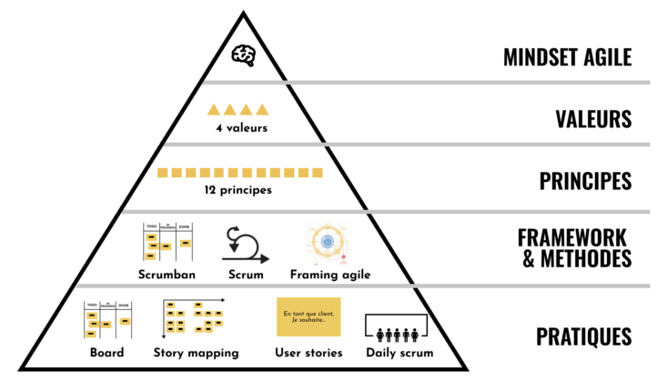
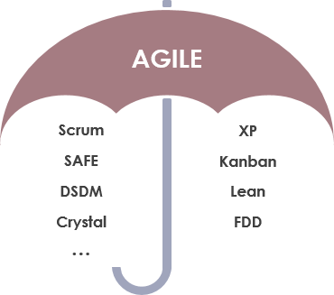

+++
linkTitle = "Comment devenir Agile ?"
title = "Comment créer une équipe Agile ?"
weight = 50
+++

{}
Vous ne pouvez pas créer une équipe Agile sans comprendre et partir du haut de la pyramide
{}

Comme nous l’avons déjà évoqué, Agile ne signifie pas prendre des outils et les appliquer.
Cela ne marchera pas. Vous devez (comme
une secte) penser Agile. Pour cela il faut
commencer par le haut de la pyramide pour
finalement arriver aux pratiques.
**Personne ne va changer ses petites habitudes,
va comprendre les avantages**. 

{}
Créer une équipe Agile c’est travailler en premier sur le mindset puis seulement après sur les
frameworks et pratiques.
{}

## Le Mindset Agile
C'est ce que nous avons vu dans la section dédié à la philosophie Agile.

Également il est important de ne pas confondre Agile et les Framework Agile. Agile représente une philosophie globale pour le développement de logiciels. Elle met l’accent sur la création d’un produit de haute qualité via des itérations.
Pour accomplir cet objectif, de nombreux frameworks ont été développés.

