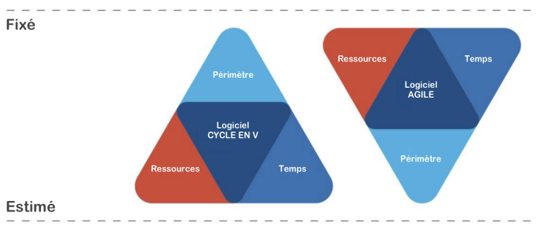
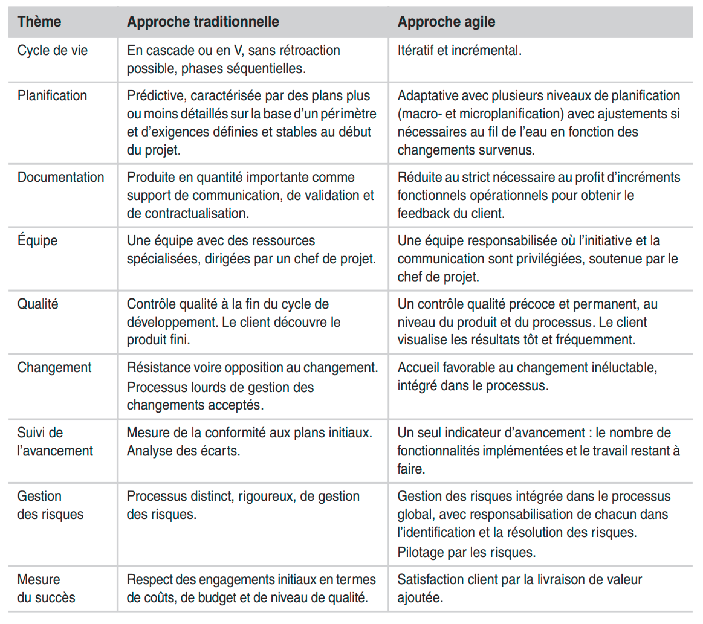

+++
title = "Agile VS Traditionnelle"
weight = 20
+++

Dans un modèle en cascade, on ne commence la phase suivante uniquement lorsque la précédente est finie. Par conséquent :
- en cas de détection des défauts, nous devons revenir en arrière.
- en cas de retard, toutes les autres phases sont retardées.

L’agilité permet d’éviter ces problèmes. Nous travaillons les besoins de l’utilisateur de manière
dynamique.

## Triangle de fer

| Traditionnelle      | Agile                                             |
| ------------------- | ------------------------------------------------- |
| Périmètre : fixe    | Périmètre : peut changé (écoute du client)        |
| Coût/Temps : estimé | Coût/Temps : fixe (engagement sur des itérations) |

## Tableau des différences

## Taux de réussite
L’étude Chaos Study menée par le Standish Group affirme que

{}
Agile projects are statistically 2x more likely to succeed and 1/3 less likely to fail than
Waterfall projects
{}

| Traditionnelle | Agile        |
| -------------- | ------------ |
| Succès : 14%   | Succès : 42% |
| Échec : 21%    | Échec : 8%   |

## Quand utiliser l’agilité

{}
L’agilité permet de délivrer de la valeur dans un "monde" avec un haut degré d’incertitude,
de risque et de compétition. L’équipe pourra réagir le plus rapidement possible.
{}

Lorsque d’un logiciel va être **soumis à beaucoup de changement**, il est intéressant de se pen-
cher sur une utilisation Agile