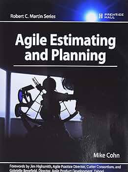

+++
title = "Planification et Agile"
weight = 4
isBoldTitle = true
+++

{}
- A lire également [A-t-on besoin de planifier ?]({})
- A lire également [A-t-on besoin d'estimer ?]({})
- [4 Mike Cohn Agile Planning - Youtube](https://youtu.be/Q8jRJOJerqk)
{}

Planifier et estimer sont fortement liés, ainsi en abordant la planification dans ce chapitre nous aborderons également quelque thématique liées à l'estimation