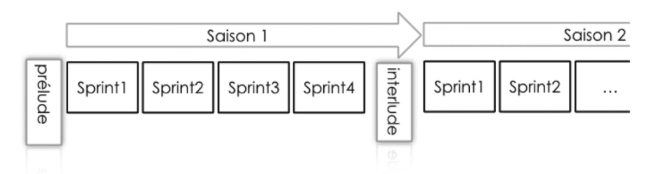

+++
title = "Plan de Release"
weight = 30
+++

{}
- [Faire une planning release en agile](https://blog.myagilepartner.fr/index.php/2017/06/11/faire-une-planning-release/)
{}

## Prélude, Interlude, Postlude
Avant nos saisons nous avons un prélude, entre nos saisons nous réaliserons l’interlude avant de finir avec le postlude

### Le Prélude
Claude Aubry dans sa 5ème édition dédié un chapitre au Prélude avant d'en dédier une partie dans la 6ème édition.

> Pour alimenter le sprint 2, on affine pendant le sprint 1. Alors pour alimenter le sprint 1, on a donc besoin d’affiner avant… d’où l’appellation courante de sprint zéro. Cependant, le sprint zéro n’existe pas.

Le prélude est donc cette période innommée, sans nom, ou mal nommée.